<!-- markdownlint-disable MD033 -->
<h1 align="center"> 𝐻𝑖 𝑡ℎ𝑒𝑟𝑒, 𝐼 𝑎𝑚 𝑇𝑟𝑎𝑥𝑡𝑜𝑛 </h1>

<!-- Marquee stuff -->

   
  

<!-- Self introduction -->
<h2>🧑🏼‍🔬 About Me</h2>

<h3><samp><ul>
  <li>Love programming, innovation and experimentation</li>
  <li>Enjoy taking on new challenges and learning new skills</li>
  <li>Hope to solve problems in processes through algorithms</li>
  <li>Open to collaboration and exploring new opportunities</li>
</ul></samp></h3>

<!-- GitHub activity stuff -->
<h2>🏆 GitHub Stats</h2>

<table>
  <tr>
    <td width="59%">
      
    </td>
    <td width="41%">
      
    </td>
  </tr>
</table>

<!-- Contribution stuff (Not available yet) -->
<!-- 

  
<h2>🗃️ Top Projects I've Contributed To</h2>

  

    
  

  

    
  

 -->

<!-- LICENSE stuff -->

  This GitHub profile is licensed under a <a href="http://creativecommons.org/licenses/by-nc-nd/4.0/">Creative Commons Attribution-NonCommercial-NoDerivs 4.0 International License</a>.

  

